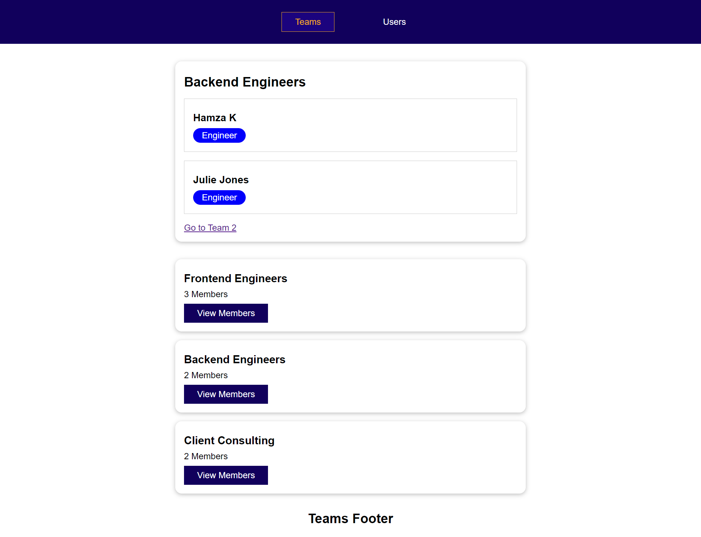

# Vue Router

This repository explores various features of Vue Router, including:

- Route Definition
- Active Link 
- Route and Query Parameters
- Nested (Child) Routes
- Named Routes
- Route Guards (Navigation Guards)
  - **Global Guards**: `beforeEach`, `afterEach`
  - **Per-Route Guards**: `beforeEnter`
  - **In-Component Guards**: `beforeRouteEnter`, `beforeRouteUpdate`, `beforeRouteLeave`
- Programmatic Navigation
- Metadata Handling
- 404 Error Pages
- Scroll Behavior
- And more

## Screenshot

